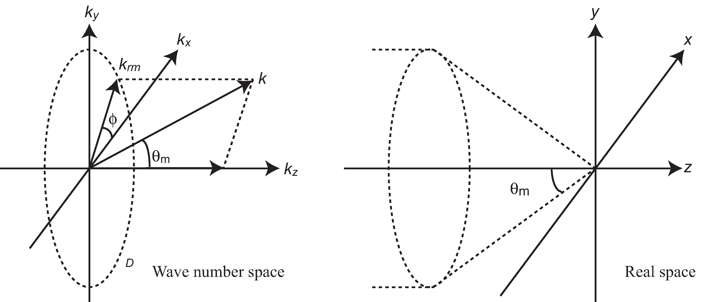

# multi_fbeam
This is the electromagnetic field analysis program for focused beams.
This program can analyze plane wave, focused plane wave, focused radial-azimuthal polarization beam, focused Gaussian beam.
In additon, spiral phase modulated beam ( like a Laguerre Gaussian beam ) and Bessel beam can be analyzed. 
This program also supports superposition of these beams. The analysis method used here based on Fourier optics.  

## Usage of example code  

1. type 'make' command to compile. libpng is required.  
   The executable example1.out, example2.out and example3.out are created. 
   The example1.out is the executable of source code example1.c, it shows a simplest example using "multi_fbeam". 
   The example2.out is the executable of source code example2.c, it shows a example of electromagnetic field intensity analysis.
   The example3.out is the executable of source code example3.c, 
   it shows a example of outputting the instantaneous value of the electromagnetic field as an image.  

3. type './example1.out'.  
   This executable calculates electromagnetic field. The beam datafile "fpw.txt" is used. 
   The "fpw.txt" is the sample of focused plane wave datafile. 
   This program searches for a beam datafile in current directory using the default beam datafile name and reads the found file. 
   The default beam datafile name is defined for plane wave as "ipw.txt", 
   for focused plane wave as "fpw.txt", for spiral phase modulated beam as "lgb.txt", 
   for focused radial-azimuthal polarization beam as "rab.txt", 
   for Bessel beam as "bsb.txt", for spiral phase modulated Bessel beam as "blg.txt",
   for focused Gaussian beam as "fgb.txt". 
   The samples of beam datafile are in the folder beam_sample, please copy and use.  
    
4. type './example2.out'.   
   This executable calculates electromagnetic field intensity distributions, outputs them to text files. 
   The I_example2.png is the visualization result of intensity distributions,
   created by Gnuplot script "gscritp.plt" (converted eps to png by using ImageMagick).  

5. type './example3.out'.  
   This executable calculates instantaneous value of the electromagnetic fields, outputs them to png image files.
   The image files are output to the folder "images" that is automatically created at runtime.
   Each image file has a name that indicates the cross section, field component and number of time steps (ex. xz_Ex_014.png). 
   The color bar is output as "color_bar.png" in the same folder. 
   The range of color bar in each cross section is output to the info.txt file (xy_info.txt for x-y plane).
   The xz_Ex.gif and the xy_Ex.gif are animated gifs that concatenate the png files created by using the shell script file "gif_animation.sh". 
   
Please see mfb_src/multi_fbeam.h for detail of functions. 
The example2.out and example3.out are parallelized by using OpenMP. 
The number of threads is controlled by the environment variable OMP_NUM_THREADS. 
The file named make_icx is the makefile for intel compiler. 
For this code, Intel compiler is about twice faster than gcc (using gcc version 9.3.0, icx version 2021.4.0). 

")
")")  

## Analysis sample 1 (in the folder analysis_sample1)  

This is the analysis result of focused beam with spiral phase modulation. 
")
")")  

## Verification  

The verification program is in the folder verification. 
This program show the verification results about focused plane wave and focused Gaussian beam. 
The executable "fpw_verification.out" and "fgb_verification.out" are created by 'make' command. 

## System of units

This program use the own defined system of units (OSU), optimized for optics. 
The system of units is defined as $c_0=1$ ( speed of light in vacuum ), $\mu_0=1$ ( permeability of vacuum ). 
For the conversion from OSU to MKSA system of units, the unit of length in OSU is defined as 
$1\times10^{-6}$ [m] in MKSA, the unit of power in OSU is defined as $1\times10^{-3}$ [W] in MKSA. 
The conversions of base unit are follows.

$$
\begin{eqnarray}
a &=& 1\times10^{-6},\\
b &=& 1\times10^{-3}.
\end{eqnarray}
$$

$$
\begin{eqnarray}
a \\,\mathrm{[m]} &=& 1 \\,\mathrm{[L]},\\
\frac{ab}{c_0^3} \\,\mathrm{[kg]} &=& 1 \\,\mathrm{[M]},\\
\frac{a}{c_0} \\,\mathrm{[s]} &=& 1 \\,\mathrm{[T]},\\
\sqrt{\frac{b}{c_0\mu_0}} \\,\mathrm{[A]} &=& 1 \\,\mathrm{[I]}.
\end{eqnarray}
$$

Please see com_src/osu_mksa.h and com_src/osu_mksa.c for detail of conversions.

## Formulae for electromagnetic field
Electromagnetic wave is assumed monochromatic wave. The surroundings is assumed nonmagnetic. 
The elementary formula is $u(\mathbf{r},t)=u(\mathbf{r})\exp(-i{\omega}t)$. 
The time related complex exponential is dropped form all subsequent expressions. 
The z-axis is selected as optic axis.

- Plane wave  

  $$
  \begin{eqnarray}
  \mathbf{E}(x,y,z) &=& E_0 \mathbf{e}\_0 \exp(ik_zz),\\
  \mathbf{H}(x,y,z) &=& H_0 \mathbf{h}\_0 \exp(ik_zz),\\
  E_0 &=& \sqrt{2ZS},\\
  H_0 &=& \frac{E_0}{Z},\\
  \mathbf{h}\_0 &=& \left( -e_{0y}, e_{0x}, 0 \right).
  \end{eqnarray}
  $$
   
  $E_0$ is a power coefficient. $Z$ is a wave impedance. $S$ is a power per unit square metre. 
  $\mathbf{e}\_0$ is a polarization coefficient include initial phase, $|\mathbf{e}\_0|=1$. For example 
  
  $$
  \begin{eqnarray}
  \mathbf{e}\_0 &=& (1,0,0), \\, \text{for x polarization}. \\
  \mathbf{e}\_0 &=& (0,1,0), \\, \text{for y polarization}. \\
  \mathbf{e}\_0 &=& \left( \frac{1}{\sqrt{2}}, \pm\frac{i}{\sqrt{2}}, 0 \right), \\, \text{for circular polarization}. 
  \end{eqnarray}
  $$

- Focused plane wave  

  $$
  \begin{eqnarray}
  \mathbf{E}(x,y,z) &=& E_0 \int \\!\\!\\!\int_{\Omega} 
   \mathbf{e}(\theta,\phi)\exp\left(ik(x\sin\theta\cos\phi+y\sin\theta\sin\phi+z\cos\theta)\right)\sin\theta \\, d(\sin\theta)d\phi, \\
  \Omega &=& \left\\{(\sin\theta,\phi):0\le\sin\theta\le\frac{\mathrm{NA}}{n},-\pi<\phi\le\pi\right\\}, \\
  e_{x}(\theta,\phi) &=& e_{px}(\sin^2\phi+\cos\theta\cos^2\phi)+e_{py}\sin\phi\cos\phi(\cos\theta-1), \\
  e_{y}(\theta,\phi) &=& e_{px}(\sin\phi\cos\phi(\cos\theta-1)+e_{py}(\cos\theta\sin^2\phi+\cos^2\phi), \\
  e_{z}(\theta,\phi) &=&-e_{px}\sin\theta\cos\phi-e_{py}\sin\theta\sin\phi, \\
  E_0 &=& \sqrt{2ZP}\frac{1}{\lambda}, \\
  \mathbf{e}\_p &=& \sqrt{\frac{1}{\pi}}\frac{n}{\mathrm{NA}}\mathbf{p}\_f.
  \end{eqnarray}
  $$
  
  $$
  \begin{eqnarray}
  \mathbf{H}(x,y,z) &=& H_0 \int\\!\\!\\! \int_{\Omega}
   \mathbf{h}(\theta,\phi)\exp\left(ik(x\sin\theta\cos\phi+y\sin\theta\sin\phi+z\cos\theta)\right)\sin\theta \\, d(\sin\theta)d\phi,\\
  h_x(\theta,\phi) &=& e_{px}\sin\phi\cos\phi(\cos\theta-1)-e_{py}(\sin^2\phi+\cos\theta\cos^2\phi),\\
  h_y(\theta,\phi) &=& e_{px}(\cos\theta\sin^2\phi+\cos^2\phi)-e_{py}\sin\phi\cos\phi(\cos\theta-1),\\
  h_z(\theta,\phi) &=&-e_{px}\sin\theta\sin\phi+e_{py}\sin\theta\cos\phi,\\
  H_0 &=& \frac{E_0}{Z}.
  \end{eqnarray}
  $$
  
  $P$ is a power passing through the plane orthogonal to z-axis, or passing through the pupil plane. $\lambda$ is a wavelength.
  $\mathbf{e}\_p$ is a normalized coefficient, $\mathrm{NA}$ is a numerical aperture, $n$ is a refractive index of surroundings, 
  $\mathbf{p}\_f$ is a polarization coefficient incluse initial phase, same as $\mathbf{e}\_0$ in plane wave.  
  
  
  
- Focused plane wave with spiral phase modulation

  $$
  \begin{eqnarray}
  \mathbf{E}(x,y,z) &=& E_0 \int \\!\\!\\! \int_{\Omega}
   \mathbf{e}(\theta,\phi)\exp\left(ik(x\sin\theta\cos\phi+y\sin\theta\sin\phi+z\cos\theta)+im\phi\right)\sin\theta \\, d(\sin\theta)d\phi,\\
  \mathbf{H}(x,y,z) &=& H_0 \int \\!\\!\\! \int_{\Omega}
   \mathbf{h}(\theta,\phi)\exp\left(ik(x\sin\theta\cos\phi+y\sin\theta\sin\phi+z\cos\theta)+im\phi\right)\sin\theta \\, d(\sin\theta)d\phi.
  \end{eqnarray}
  $$
  
  $m$ is a mode number, must be integer ( $m=0$ is focused plane wave ). Others are the same as focused plane wave.

- Focused radial-azimuthal polarization beam  

  $$
  \begin{eqnarray}
  \mathbf{E}(x,y,z) &=& E_0 \int \\!\\!\\! \int_{\Omega}
   \mathbf{e}(\theta,\phi)\exp\left(ik(x\sin\theta\cos\phi+y\sin\theta\sin\phi+z\cos\theta)\right)\sin\theta \\, d(\sin\theta)d\phi,\\
  \Omega &=& \left\\{ (\sin\theta,\phi) : 0\le\sin\theta\le\frac{\mathrm{NA}}{n},-\pi<\phi\le\pi \right\\},\\
  e_x(\theta,\phi) &=& e_{vr}\cos\theta\cos\phi-e_{va}\sin\phi,\\
  e_y(\theta,\phi) &=& e_{vr}\cos\theta\sin\phi+e_{va}\cos\phi,\\
  e_z(\theta,\phi) &=&-e_{vr}\sin\theta,\\
  E_0 &=& \sqrt{2ZP}\frac{1}{\lambda},\\
  \mathbf{e}\_v &=& (e_{vr},e_{va}) = \sqrt{\frac{1}{\pi}}\frac{n}{\mathrm{NA}}\mathbf{p}\_v.
  \end{eqnarray}
  $$
  
  $$
  \begin{eqnarray}
  \mathbf{H}(x,y,z) &=& H_0 \int \\!\\!\\! \int_{\Omega}
   \mathbf{h}(\theta,\phi)\exp\left(ik(x\sin\theta\cos\phi+y\sin\theta\sin\phi+z\cos\theta)\right)\sin\theta \\, d(\sin\theta)d\phi,\\
  h_x(\theta,\phi) &=&-e_{va}\cos\theta\cos\phi-e_{vr}\sin\phi,\\
  h_y(\theta,\phi) &=&-e_{va}\cos\theta\sin\phi+e_{vr}\cos\phi,\\
  h_z(\theta,\phi) &=& e_{va}\sin\theta,\\
  H_0 &=& \frac{E_0}{Z}.
  \end{eqnarray}
  $$
  
  $\mathbf{p}\_v$ is a polarization coefficient, $|\mathbf{p}\_v|=1$. For example
  
  $$
  \begin{eqnarray}
  \mathbf{p}\_v &=& (1,0), \\, \text{for radial-polarization},\\
  \mathbf{p}\_v &=& (0,1), \\, \text{for azimuthal-polarization},\\
  \mathbf{p}\_v &=& \left( \frac{1}{\sqrt{2}},\frac{1}{\sqrt{2}} \right), \\, \text{for combined-polarization}.
  \end{eqnarray}
  $$
  
  

- Bessel beam  

  $$
  \begin{eqnarray}
  \mathbf{E}(x,y,z) &=& E_0 \int_0^{2\pi}
   \mathbf{e}(\theta_d,\phi)\exp\left(ik(x\sin\theta_d\cos\phi+y\sin\theta_d\sin\phi+z\cos\theta_d)\right)\sin\theta_d \\, d\phi,\\
  e_x(\theta_d,\phi) &=& p_{fx}(\sin^2\phi+\cos\theta_d\cos^2\phi)+p_{fy}\sin\phi\cos\phi(\cos\theta_d-1),\\
  e_y(\theta_d,\phi) &=& p_{fx}\sin\phi\cos\phi(\cos\theta_d-1)+p_{fy}(\cos\theta_d\sin^2\phi+\cos^2\phi),\\
  e_z(\theta_d,\phi) &=&-p_{fx}\sin\theta_d\cos\phi-p_{fy}\sin\theta_d\sin\phi,\\
  E_0 &=& \sqrt{2ZS}.
  \end{eqnarray}
  $$
  
  $$
  \begin{eqnarray}
  \mathbf{H}(x,y,z) &=& H_0 \int_0^{2\pi}
   \mathbf{h}(\theta_d,\phi)\exp\left(ik(x\sin\theta_d\cos\phi+y\sin\theta_d\sin\phi+z\cos\theta_d)\right)\sin\theta_d \\, d\phi,\\
  h_x(\theta_d,\phi) &=&-p_{fy}(\sin^2\phi+\cos\theta_d\cos^2\phi)-p_{fx}\sin\phi\cos\phi(\cos\theta_d-1),\\
  h_y(\theta_d,\phi) &=&-p_{fy}\sin\phi\cos\phi(\cos\theta_d-1)+p_{fx}(\cos\theta_d\sin^2\phi+\cos^2\phi),\\
  h_z(\theta_d,\phi) &=& p_{fy}\sin\theta_d\cos\phi-p_{fx}\sin\theta_d\sin\phi,\\
  H_0 &=& \frac{E_0}{Z}.
  \end{eqnarray}
  $$
  
  $\theta_d$ is a deflection angle, formed by wave number vector and z-axis. 
  For axicon prism
  $$\theta_d=\sin^{-1}\left(\frac{n_p}{n_s}\sin\theta_p\right)-\theta_p$$
  $\theta_p$ is a prism angle, $n_p$ is a refractive index of prism, $n_s$ is a refractive index of surroundings.  

- Bessel beam with spiral phase modulation  

  $$
  \begin{eqnarray}
  \mathbf{E}(x,y,z) &=& E_0 \int_0^{2\pi}
   \mathbf{e}(\theta_d,\phi)\exp\left(ik(x\sin\theta_d\cos\phi+y\sin\theta_d\sin\phi+z\cos\theta_d)+im\phi\right)\sin\theta_d \\, d\phi,\\
  \mathbf{H}(x,y,z) &=& H_0 \int_0^{2\pi}
   \mathbf{h}(\theta_d,\phi)\exp\left(ik(x\sin\theta_d\cos\phi+y\sin\theta_d\sin\phi+z\cos\theta_d)+im\phi\right)\sin\theta_d \\, d\phi.
  \end{eqnarray}
  $$
  
  $m$ is a mode number, must be integer ( $m=0$ is focused plane wave ). Others are the same as bessel beam.

- Three-dimensional rotation matrix for rotation of optic axis

  $$
  R=
  \begin{bmatrix}
  \cos\theta\cos\phi^2+\sin^2\phi & \sin\phi\cos\phi(\cos\theta-1) & \sin\theta\cos\phi \\
  \sin\phi\cos\phi(\cos\theta-1) & \cos\theta\sin^2\phi+\cos^2\phi & \sin\theta\sin\phi \\
  -\sin\theta\cos\phi & -\sin\theta\sin\phi & \cos\theta\end{bmatrix}.
  $$
  
  $\theta$ is a rotation angle. $\phi$ is a angle on x-y plane, it shows rotation plane parallel to z-axis. 
  $\phi=0$ means rotation arround y-axis. This rotation matrix cannot rotate around z-axis.
  

## Formulae for numerical verification  

- Focused plane wave  

  $$
  \begin{eqnarray}
  E_x(0,0,0) &=& E_0 e_{px}\frac{\pi}{6}\left(2\sin^2\theta_M\cos\theta_M+3\sin^2\theta_M-2\cos\theta_M+2\right),\\
  E_y(0,0,0) &=& E_0 e_{py}\frac{\pi}{6}\left(2\sin^2\theta_M\cos\theta_M+3\sin^2\theta_M-2\cos\theta_M+2\right),\\
  E_z(0,0,0) &=& 0,\\
  \sin\theta_M &=& \frac{\mathrm{NA}}{n}.
  \end{eqnarray}
  $$
  
  $$
  \begin{eqnarray}
  E_x(0,0,z) &=& E_0 e_{px}\frac{\pi}{k^3z^3} \left\[
   \exp(ikz\cos\theta_M) \left\\{ ik^2z^2\cos\theta_M(\cos\theta_M+1)-kz(2\cos\theta_M+1)-2i \right\\} \right.\\
   & & \left. +\exp(ikz)(-2ik^2z^2+2kz+2i) \right\],\\
  E_y(0,0,z) &=& E_0 e_{py}\frac{\pi}{k^3z^3} \left\[
   \exp(ikz\cos\theta_M) \left\\{ ik^2z^2\cos\theta_M(\cos\theta_M+1)-kz(2\cos\theta_M+1)-2i \right\\} \right.\\
   & & \left. +\exp(ikz)(-2ik^2z^2+2kz+2i) \right\],\\
  E_z(0,0,z) &=& 0.
  \end{eqnarray}
  $$
  
  From Fraunhofer diffraction ( $\mathrm{NA}\simeq 0$ )  
  
  $$
  \begin{eqnarray}
  P_u &=& c \int \\!\\!\\! \int_S \frac{1}{4} \left( \epsilon |\mathbf{E}(x,y,0)|^2 + \mu |\mathbf{H}(x,y,0)|^2 \right) \\, dxdy,\\
  P_s &=& \int \\!\\!\\! \int_S \frac{1}{2} \Re \left( \mathbf{E}(x,y,0)\times \mathbf{H}^{\*}(x,y,0) \right) \cdot\mathbf{n}\_s \\, dxdy,\\
  S &=& \left\\{ (x,y,0) : x^2+y^2 \le \left( \frac{d}{2} \right)^2 \right\\},\\
  d &\simeq& 1.220 \frac{\lambda_0}{\mathrm{NA}},\\
  \frac{P_u}{P} &\simeq& \frac{P_s}{P} \simeq 0.8378.
  \end{eqnarray}
  $$
  
  $\epsilon$ is a permittivity, $\mu$ is a permeability, $c$ is a speed of light, $\mathbf{n}\_s=(0,0,1)$, 
  $d$ is a diameter of beam spot ( diameter of airy disk ), $\lambda_0$ is a wavelength in vacuum.  

- Focused plane wave with spiral phase modulation  

  $$
  \begin{eqnarray}
  E_x(0,0,0) &=& 
   \begin{cases}
      E_0 \left( 2e_{px}+ime_{py} \right)\frac{\pi}{24}\left(2\sin^2\theta_M\cos\theta_M-3\sin^2\theta_M-2\cos\theta_M+2\right),&|m|=2\\
      0, &|m|\neq2,m\neq0
   \end{cases},\\
  E_y(0,0,0) &=& 
   \begin{cases}
      E_0 \left( ime_{px}-2e_{py}\right)\frac{\pi}{24}\left(2\sin^2\theta_M\cos\theta_M-3\sin^2\theta_M-2\cos\theta_M+2\right),&|m|=2\\
      0,&|m|\neq2,m\neq0
   \end{cases},\\
  E_z(0,0,0) &=& 
   \begin{cases}
      -E_0(e_{px}+ime_{py})\frac{\pi}{3}\sin^3\theta_M,&|m|=1\\
      0,&|m|\neq1
   \end{cases}.
  \end{eqnarray}
  $$
  
  
  
- Focused radial-azimuthal polarization beam  

  $$
  \begin{eqnarray}
  E_x(0,0,0) &=& 0,\\
  E_y(0,0,0) &=& 0,\\
  E_z(0,0,0) &=&-E_0 e_{vr} \frac{2\pi}{3}\sin^3 \theta_M.
  \end{eqnarray}
  $$

- Bessel beam  

  $$
  \begin{eqnarray}
  E_x(0,0,z) &=& E_0 p_{fx}\pi\sin\theta_d(\cos\theta_d+1)\exp(ikz\cos\theta_d),\\
  E_y(0,0,z) &=& E_0 p_{fy}\pi\sin\theta_d(\cos\theta_d+1)\exp(ikz\cos\theta_d),\\
  E_z(0,0,z) &=& 0.
  \end{eqnarray}
  $$

  
- Bessel beam with spiral phase modulation   

  $$
  \begin{eqnarray}
  E_x(0,0,z) &=& 
   \begin{cases}
      E_0(2p_{fx}+imp_{fy})\frac{\pi}{4}\sin\theta_d(\cos\theta_d-1)\exp(ikz\cos\theta_d),&|m|=2\\
      0,&|m|\neq2,m\neq0
   \end{cases},\\
  E_y(0,0,z) &=& 
   \begin{cases}
      E_0(imp_{fx}-2p_{fy})\frac{\pi}{4}\sin\theta_d(\cos\theta_d-1)\exp(ikz\cos\theta_d),&|m|=2\\
      0,&|m|\neq2,m\neq 0
   \end{cases},\\
  E_z(0,0,z) &=& 
   \begin{cases}
      -E_0(p_{fx}+imp_{fy})\pi\sin^2\theta_d\exp(ikz\cos\theta_d),&|m|=1\\
      0,&|m|\neq1,m\neq 0
   \end{cases}.
  \end{eqnarray}
  $$
  
  

## References  

1. The command-line driven graphing utility [gnuplot](http://www.gnuplot.info/)  
2. The utilities for manipulating images [ImageMagick](https://imagemagick.org/)  
3. The official PNG reference library [libpng](http://www.libpng.org/pub/png/libpng.html)  
4. Davis, L. W. "Theory of electromagnetic beams." Physical Review A 19.3 (1979): 1177.
5. Barton, J. P., D. R. Alexander, and S. A. Schaub. "Internal and near‐surface electromagnetic fields for a spherical particle irradiated by a focused laser beam." Journal of Applied Physics 64.4 (1988): 1632-1639.

2022/07/31  Added first-order focused Gaussian beam.
